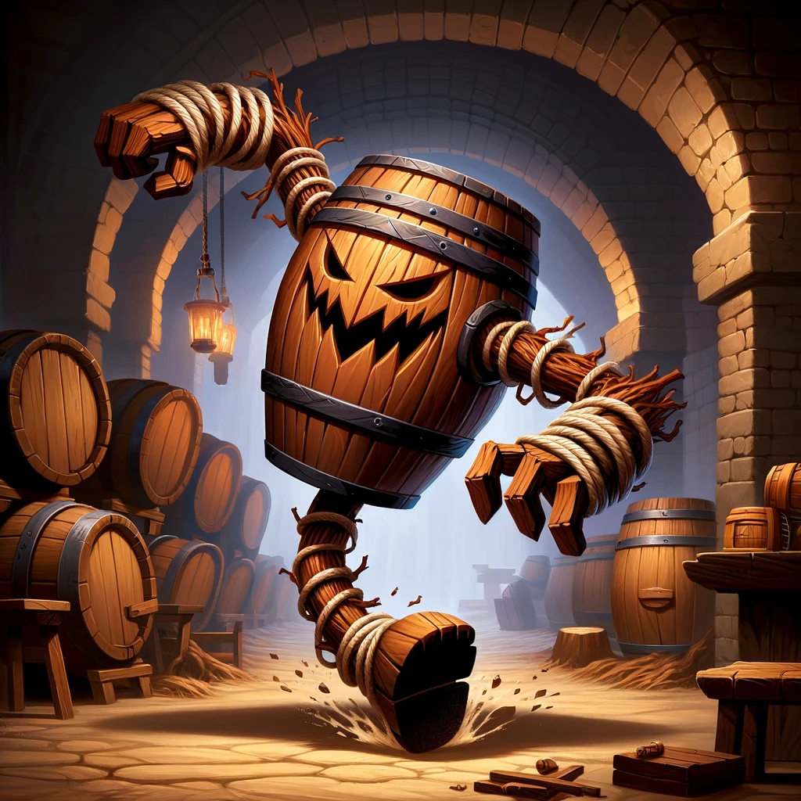
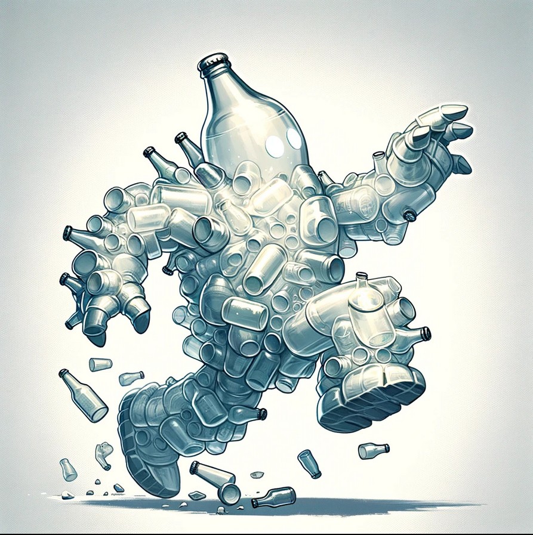

 Forest Monsters 

Glowcap Funglings

- **CR:** 1/4
- **AC:** 12
- **HP:** 7 (2d6)
- **Speed:** 20 ft.
- **Attack (Spore Release):** +3 to hit, range 10 ft., one target. **Hit:** The target must succeed on a DC 12 Constitution saving throw or become poisoned for 1 hour. While poisoned in this way, the target is disoriented and has disadvantage on attack rolls and ability checks.
- **Vulnerabilities:** Fire
- **Senses:** Darkvision 60 ft.
- **Languages:** Understands Sylvan but can't speak
- **Glowcap Spores:** Can be used in brewing or sold. Worth approximately 10-15 gold pieces.

Forest Sprites

- **CR:** 1
- **AC:** 15
- **HP:** 10 (3d6)
- **Speed:** 10 ft., fly 40 ft.
- **Attacks:**
  - **Magic Tricks (Recharge 5-6):** Casts *Minor Illusion*, *Dancing Lights*, or *Faerie Fire* (DC 13 Wisdom saving throw to resist effects). No components required.
  - **Tangle:** Melee Spell Attack: +4 to hit, reach 5 ft., one creature. **Hit:** The target is grappled (escape DC 13). While grappled, the creature is restrained and must succeed on a DC 10 Strength saving throw at the start of its turn or take 2 (1d4) piercing damage from thorns.
- **Senses:** Darkvision 60 ft.
- **Languages:** Sylvan, Common
- **Sprite Dust:** Worth 25 gold pieces or can be used for the AC bonus.

Timber Wolves

- **CR:** 1
- **AC:** 13
- **HP:** 11 (2d8+2)
- **Speed:** 40 ft.
- **Attacks:**
  - **Bite:** Melee Weapon Attack: +4 to hit, reach 5 ft., one target. **Hit:** 5 (1d6+2) piercing damage. If the target is a creature, it must succeed on a DC 11 Strength saving throw or be knocked prone.
- **Pack Tactics:** The wolf has advantage on an attack roll against a creature if at least one of the wolf's allies is within 5 feet of the creature and the ally isn't incapacitated.
- **Senses:** Passive Perception 13
- **Languages:** —
- **Wolf Pelt:** Can be sold for 5 gold pieces each. The Fang Necklace is worth 10 gold pieces or can be used in crafting.

 Level 1 Monsters 

Barrel Brawler

Animated barrels that have come to life through magical means, often found guarding breweries or as unintended consequences of magical mishaps. They attack by rolling at high speeds towards their targets or swinging makeshift limbs.

- **AC:** 12
- **HP:** 10
- **Move:** 10ft
- **Attack:** +2 to hit, reach 5 ft., one target.
- **Hit:** 3 (1d6) bludgeoning damage.
- **Special:** On destruction, the barrel releases a burst of hop-scented mist, granting temporary advantage on Constitution saving throws against being intoxicated for 1 minute to anyone within 5 feet.

These creatures add an element of surprise and humor to encounters, especially in settings tied to breweries or alchemical experiments gone awry. Their special ability upon destruction can provide a strategic advantage or an unexpected challenge to players, depending on the situation.

Yeast Beast

A unique creature found within the storeroom, the Yeast Beast acts as a guardian of the brewing ingredients. It appears as a sentient, animated mass of yeast and brewing ingredients, with a constantly shifting form. While whimsical in appearance, it can pose a challenge to those who threaten the storeroom's contents.

- **AC:** 8
- **HP:** 22 (5d8)
- **Speed:** 15 ft.
- **Attack:** Engulf. **Hit:** Engulfs a target within 5 ft., dealing 5 (2d4) bludgeoning damage and potentially trapping smaller creatures inside its mass.
- **Special:** Upon defeat, the Yeast Beast releases a cloud of intoxicating yeast, requiring a DC 10 Constitution saving throw to avoid becoming poisoned for 1 hour.

Barrel Crawlers

Smaller than the Barrel Brawlers, these animated barrel creatures scuttle around on tiny legs or tendrils, causing mischief and guarding the storeroom. They are playful yet protective of the ingredients they are enchanted to guard.

- **AC:** 10
- **HP:** 5 (2d4)
- **Speed:** 20 ft.
- **Attack:** Tendril Slap. **Hit:** +2 to hit, reach 5 ft., one target. **Hit:** 2 (1d4) bludgeoning damage.
- **Special:** On a successful hit, Barrel Crawlers can attempt to knock a potion or small item from the target's grasp.

 Level 2 

Bottle Golems

Small constructs made from leftover bottles and brewery waste, animated by the residual magic of the room.

- **AC:** 13
- **HP:** 10 (2d6+3)
- **Speed:** 30 ft.
- **Attacks:** Projectile (Bottle Throw) +3 to hit, range 20/60 ft., one target. **Hit:** 4 (1d4+2) piercing damage.
- **Special Abilities:** Shatter on Impact - Upon hitting a target or missing with a throw, the Bottle Golem shatters, potentially causing 1 (1d2) piercing damage to nearby creatures.

Ale Elementals

Sentient beings formed from spilled magical brews, with bodies made entirely of sloshing ale.

- **AC:** 8
- **HP:** 18 (4d8)
- **Speed:** 20 ft., swim 30 ft.
- **Attacks:** `Ale Soak` +3 to hit, reach 5 ft., one target. **Hit:** 5 (1d6+2) bludgeoning damage, and the target is soaked in ale, causing disadvantage on its next attack roll due to slippery hands.
`Bottle throw`: +3 to hit, 1d4 +3 damage
- **Special Abilities:** Summon Barrel - Can enter and animate a barrel of ale, turning a barrel into a barrel brawler.

Yeast Beast

A unique creature found within the storeroom, the Yeast Beast acts as a guardian of the brewing ingredients. It appears as a sentient, animated mass of yeast and brewing ingredients, with a constantly shifting form. While whimsical in appearance, it can pose a challenge to those who threaten the storeroom's contents.

- **AC:** 8
- **HP:** 22 (5d8)
- **Speed:** 15 ft.
- **Attack:** Engulf. **Hit:** Engulfs a target within 5 ft., dealing 5 (2d4) bludgeoning damage and potentially trapping smaller creatures inside its mass.
- **Special:** Upon defeat, the Yeast Beast releases a cloud of intoxicating yeast, requiring a DC 10 Constitution saving throw to avoid becoming poisoned for 1 hour.

Hop Horrors

Mutated from magical hops, these vine-like creatures attack with entangling appendages and emit a pungent aroma.

- **AC:** 13
- **HP:** 22 (4d8+4)
- **Speed:** 30 ft., climb 20 ft.
- **Attacks:** 
  - **Vine Lash:** +4 to hit, reach 10 ft., one target. **Hit:** 6 (1d6+3) slashing damage, and the target must succeed on a DC 12 Strength saving throw or be restrained.
- **Special Abilities:** 
  - **Hop Scent:** The pungent smell may cause nausea, requiring a DC 12 Constitution saving throw to resist being poisoned for 1 minute.

Alberic 

Alberic - Elemental Wizard

**Stats:**
- **AC:** 12 (15 with *Mage Armor* activated)
- **HP:** 38 (7d8+7)
- **Speed:** 30 ft.
- **Spellcasting Ability:** Intelligence (spell save DC 13, +5 to hit with spell attacks)
- **Spell Slots:** 3rd level (2 slots), 2nd level (2 slots), 1st level (3 slots)

**Spells Known:**
- **Cantrips (at will):** *Light*, *Mending*, *Message*, *Prestidigitation*
- **1st level:** *Mage Armor* (automatically activated), *Shield*, *Summon Elemental Minion* (custom spell, summons a small elemental to assist in combat)
- **2nd level:** *Misty Step*, *Summon Elemental Minion* (enhanced version, can summon two minions or one of a stronger variety)
- **3rd level:** *Counterspell*, *Summon Elemental Ally* (a more powerful summoning spell that brings forth a medium-sized elemental or several smaller ones to fight)

**Abilities:**
- **Elemental Adept:** Alberic has mastered the art of elemental magic, granting him resistance to fire, cold, and lightning damage.
- **Brewmaster's Command:** Alberic can imbue his elemental summons with properties of his brews, granting them unique abilities (e.g., a hop-infused fire elemental might leave a trail of intoxicating vapor).

