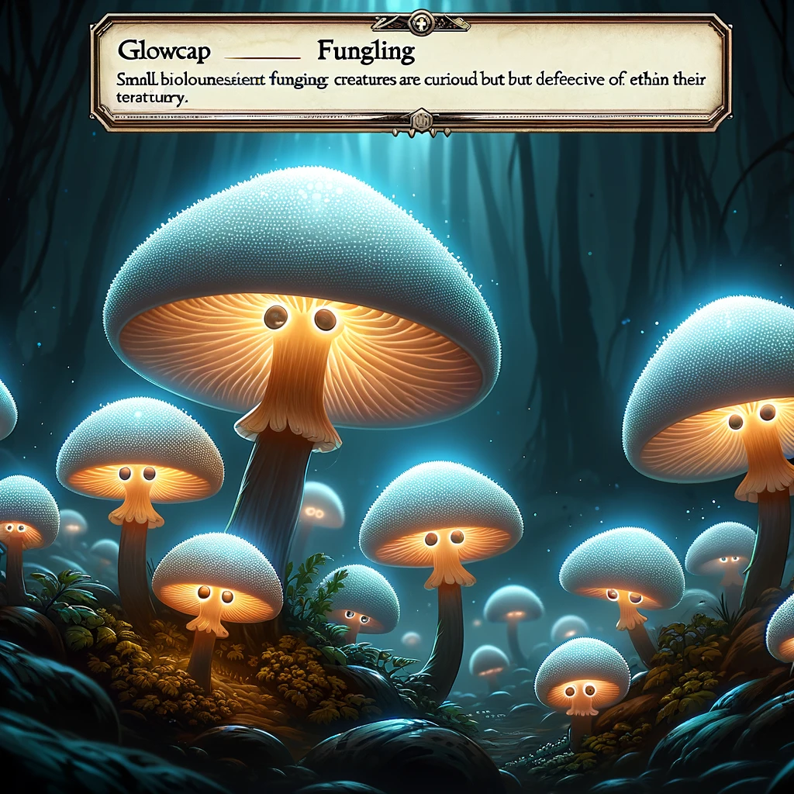
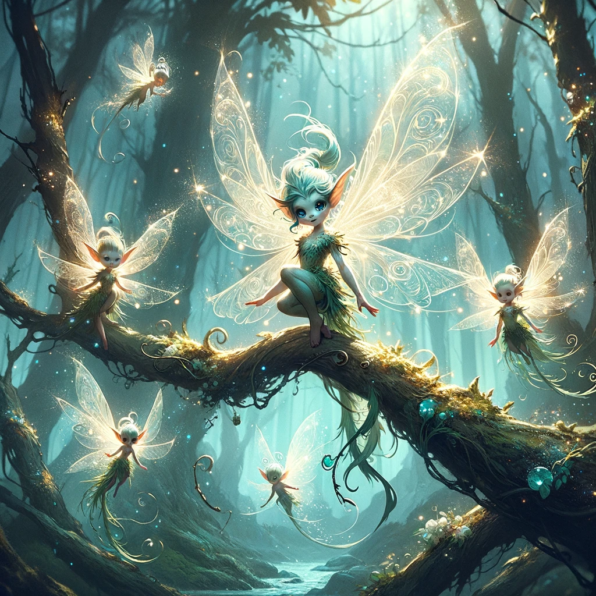
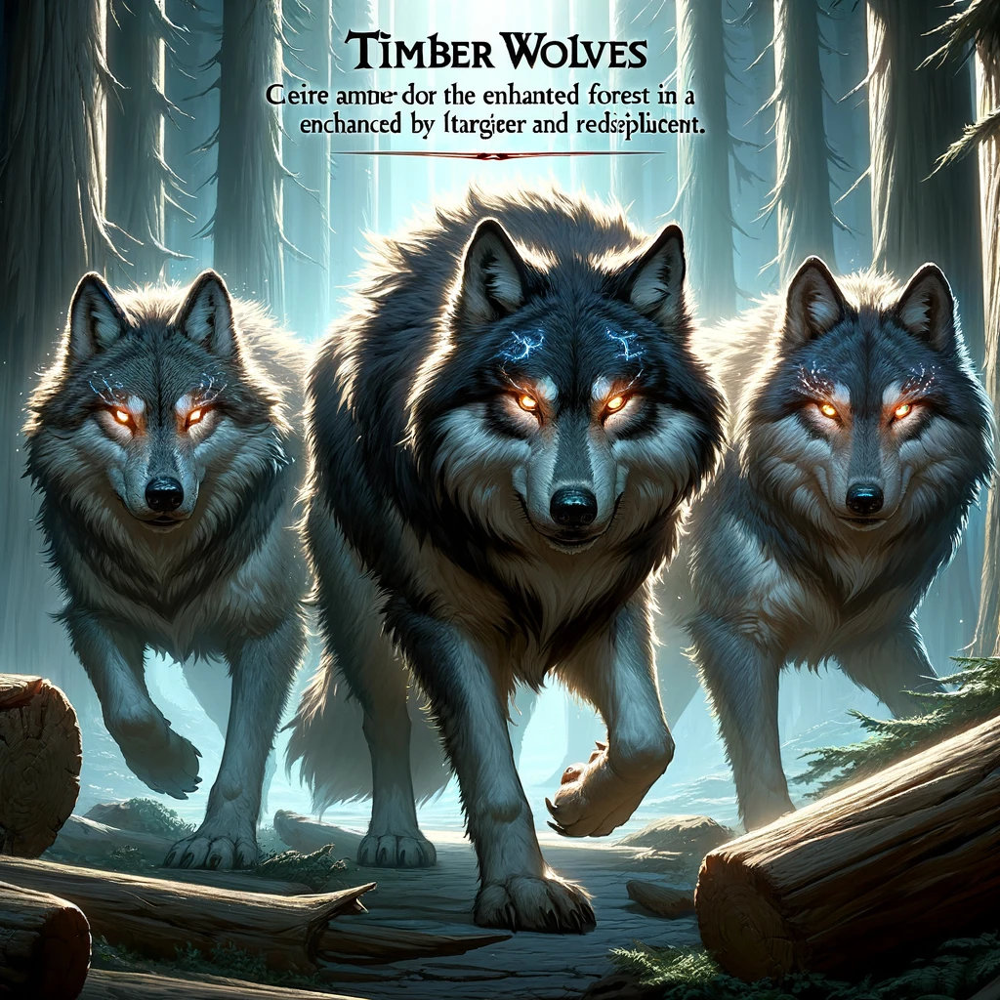

# Enchanted Forest

 Monsters 

Glowcap Funglings

- **CR:** 1/4
- **AC:** 12
- **HP:** 7 (2d6)
- **Speed:** 20 ft.
- **Attack (Spore Release):** +3 to hit, range 10 ft., one target. **Hit:** The target must succeed on a DC 12 Constitution saving throw or become poisoned for 1 hour. While poisoned in this way, the target is disoriented and has disadvantage on attack rolls and ability checks.
- **Vulnerabilities:** Fire
- **Senses:** Darkvision 60 ft.
- **Languages:** Understands Sylvan but can't speak
- **Glowcap Spores:** Can be used in brewing or sold. Worth approximately 10-15 gold pieces.

Forest Sprites

- **CR:** 1
- **AC:** 15
- **HP:** 10 (3d6)
- **Speed:** 10 ft., fly 40 ft.
- **Attacks:**
  - **Magic Tricks (Recharge 5-6):** Casts *Minor Illusion*, *Dancing Lights*, or *Faerie Fire* (DC 13 Wisdom saving throw to resist effects). No components required.
  - **Tangle:** Melee Spell Attack: +4 to hit, reach 5 ft., one creature. **Hit:** The target is grappled (escape DC 13). While grappled, the creature is restrained and must succeed on a DC 10 Strength saving throw at the start of its turn or take 2 (1d4) piercing damage from thorns.
- **Senses:** Darkvision 60 ft.
- **Languages:** Sylvan, Common
- **Sprite Dust:** Worth 25 gold pieces or can be used for the AC bonus.

Timber Wolves

- **CR:** 1
- **AC:** 13
- **HP:** 11 (2d8+2)
- **Speed:** 40 ft.
- **Attacks:**
  - **Bite:** Melee Weapon Attack: +4 to hit, reach 5 ft., one target. **Hit:** 5 (1d6+2) piercing damage. If the target is a creature, it must succeed on a DC 11 Strength saving throw or be knocked prone.
- **Pack Tactics:** The wolf has advantage on an attack roll against a creature if at least one of the wolf's allies is within 5 feet of the creature and the ally isn't incapacitated.
- **Senses:** Passive Perception 13
- **Languages:** —
- **Wolf Pelt:** Can be sold for 5 gold pieces each. The Fang Necklace is worth 10 gold pieces or can be used in crafting.

