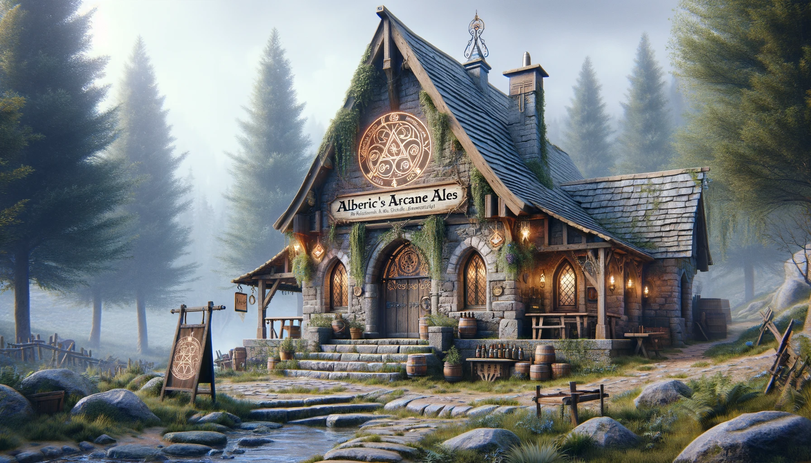
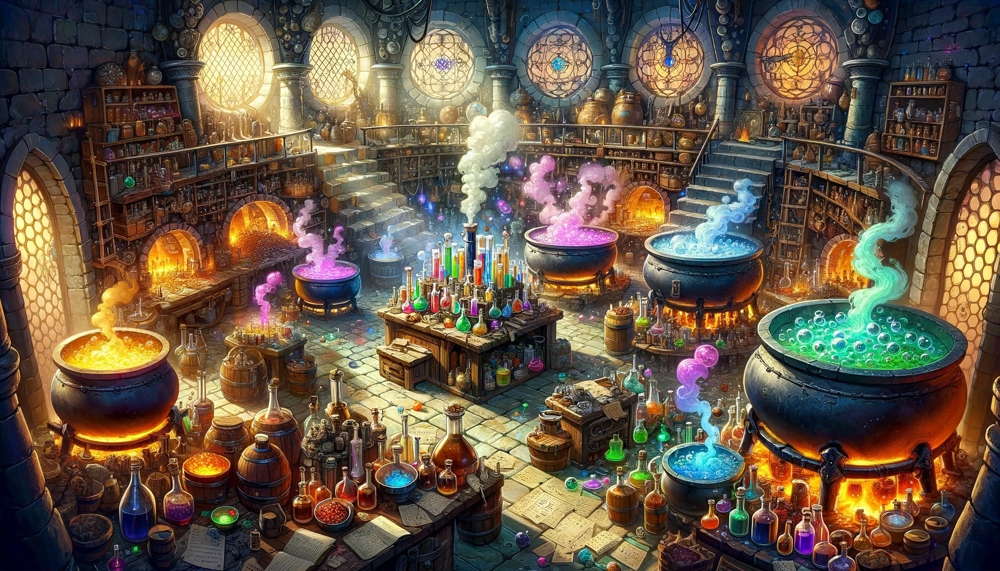
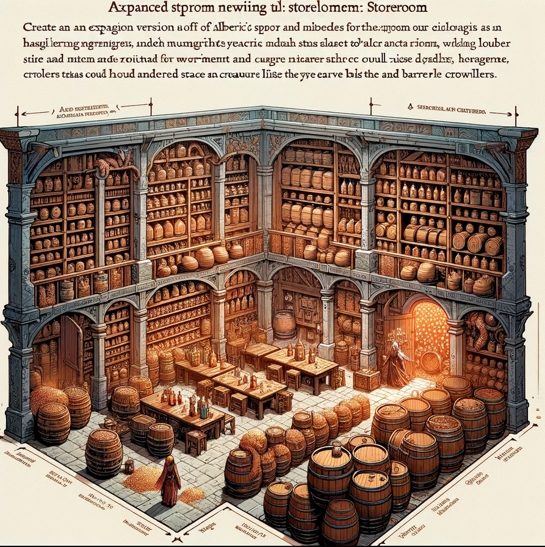
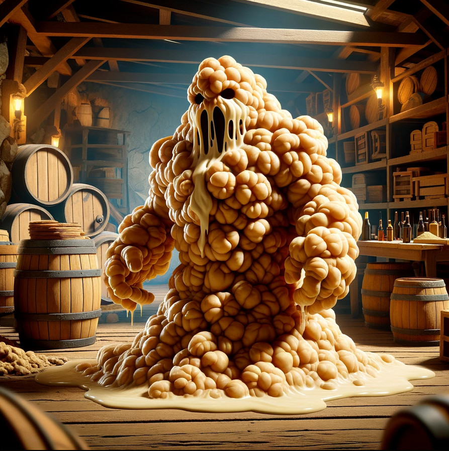
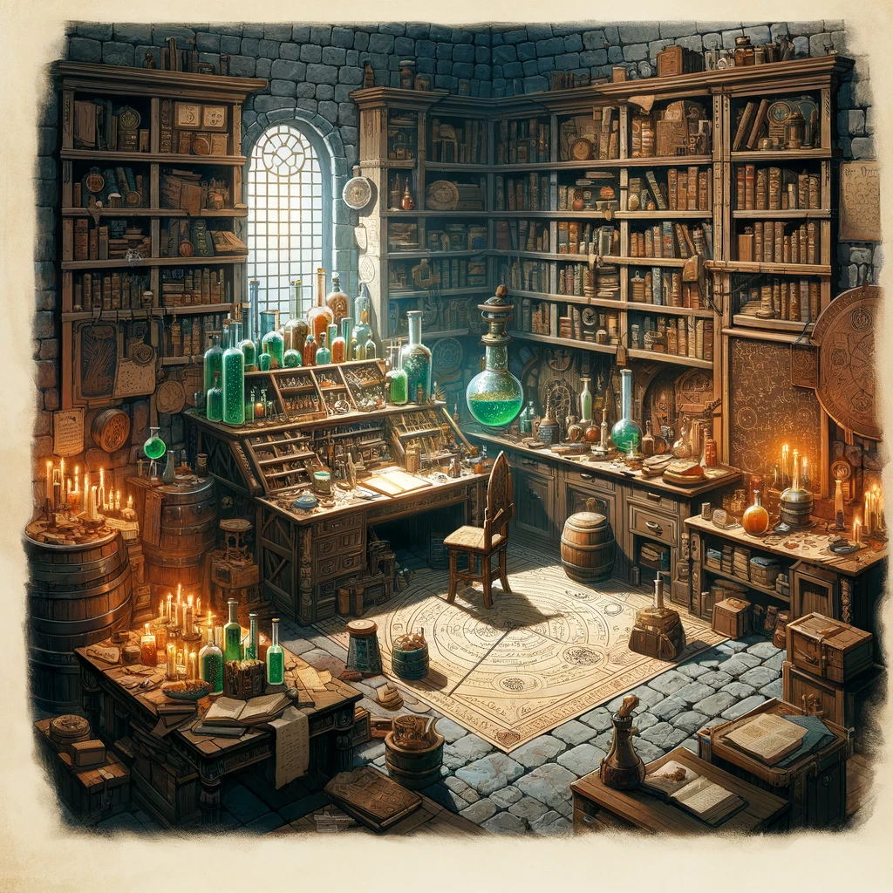

# Alberic's Arcane Ales - Level 1

Entrance - The Fermentation Foyer

The room is tiled with enchanted stones that mimic the carbonation of a freshly poured ale. As adventurers step into the room, the floor beneath them begins to fizz and pop magically. Players must make a `DC 10` dex saving throw of trigger one of the following traps. After the players set off the first trap floor `1D6` `Barrel Brawlers` wake up.  

#### Random Effects for the Magical Traps:
Player must make a dexterity save of 15 or trigger a trap
- `Feeling Woozy`: Players must make a Constitution saving throw or become disoriented from the yeast smell, suffering disadvantage on their next attack roll or ability check.
- `Slippery Steps`: A sudden burst of fermented foam makes the floor slick. Players must make a Dexterity saving throw or fall prone.
- `Mystical Mumble`: Players hearing whispering voices must succeed on an Intelligence saving throw or be compelled to speak in rhymes for the next 10 minutes, which may affect spellcasting with verbal components.

Barrel Brawler

Animated barrels that have come to life through magical means, often found guarding breweries or as unintended consequences of magical mishaps. They attack by rolling at high speeds towards their targets or swinging makeshift limbs.

- **AC:** 12
- **HP:** 10
- **Move:** 10ft
- **Attack:** +2 to hit, reach 5 ft., one target.
- **Hit:** 3 (1d6) bludgeoning damage.
- **Special:** On destruction, the barrel releases a burst of hop-scented mist, granting temporary advantage on Constitution saving throws against being intoxicated for 1 minute to anyone within 5 feet.

These creatures add an element of surprise and humor to encounters, especially in settings tied to breweries or alchemical experiments gone awry. Their special ability upon destruction can provide a strategic advantage or an unexpected challenge to players, depending on the situation.

Ale-chemy Laboratory

Once a place of magical research, now filled with bubbling cauldrons producing unpredictable potions. Funny NPC: A soused apprentice who gives cryptic hints in exchange for taste-testing his "creations."

### NPC: The Soused Apprentice

- **Name:** Gilbin Fizzwhistle
- **Race:** Gnome
- **Age:** 37
- **Basic Stats and Abilities:**
  - **Intelligence:** 16 (Smart but erratic)
  - **Wisdom:** 8 (Lacks common sense)
  - **Charisma:** 14 (Charming in a quirky way)
  - **Ability:** Can concoct a random potion effect on the spot, but not always with the intended results.

### Interaction and Sayings:
- **Greeting:** "Ah, new test subjects! I mean... guests! Care to try a sample of my latest concoction?"
- **On Potion Effects:** "Side effects? Oh, they're half the fun! Who doesn't enjoy a surprise or two?"
- **When Asked for Help:** "I could give you a hint, but where's the fun in that? Instead, how about you help me with a little experiment?"
- **On Failure:** "Well, back to the drawing board. Or maybe just back to the board. Who needs drawing anyway?"
- **On Success:** "Eureka! It worked! Mostly... I mean, you're still standing, right?"

If players ask Giblin about what happened to the brewery and Alberic he tells them he's just the chemist and hasn't seen Alberic in a while.  But if the players will help him get some ingrediants from the next room he'll them to Alberic's study.

Giblin gives the players each 2 healing potions plus 2 random potions from below after they help him get into the ingediants store room.

### List of 10 Random Potions:

1. **Elixir of Giggles**
   - **Good Effect:** Grants advantage on saving throws against being frightened for 1 hour.
   - **Bad Effect:** Causes uncontrollable laughter, imposing disadvantage on stealth checks.

2. **Potion of Hasty Feet**
   - **Good Effect:** Increases movement speed by 10 feet for 10 minutes.
   - **Bad Effect:** Imposes disadvantage on Dexterity checks due to overly speedy movements.

3. **Brew of Bulging Biceps**
   - **Good Effect:** Grants a +2 bonus to Strength checks for 1 hour.
   - **Bad Effect:** Imposes disadvantage on Dexterity saving throws due to cumbersome muscles.

4. **Draught of Diminution**
   - **Good Effect:** Allows the drinker to temporarily shrink, facilitating movement through tight spaces.
   - **Bad Effect:** Makes the drinker's voice squeaky, potentially alerting nearby creatures.

5. **Vial of Vivid Visions**
   - **Good Effect:** Grants darkvision for 8 hours.
   - **Bad Effect:** Causes mild hallucinations, imposing disadvantage on Wisdom (Perception) checks.

6. **Tincture of Tangled Tongue**
   - **Good Effect:** Grants proficiency in a new language for 1 hour.
   - **Bad Effect:** Jumbles the drinker's words, imposing disadvantage on Charisma (Persuasion) checks.

7. **Flask of Fickle Fate**
   - **Good Effect:** Gives the drinker advantage on one saving throw of their choice in the next hour.
   - **Bad Effect:** Forces the drinker to roll disadvantage on their next attack.

8. **Decoction of Dwarven Might**
   - **Good Effect:** Increases the drinker's Constitution score by 2 for 1 hour.
   - **Bad Effect:** The drinker gains a voracious appetite, requiring immediate consumption of food or suffer disadvantage on Constitution saving throws.

9. **Serum of Swift Speech**
   - **Good Effect:** Allows the drinker to speak and read twice as fast, benefiting spellcasting with verbal components.
   - **Bad Effect:** The drinker speaks so quickly that others have difficulty understanding them, imposing disadvantage on social interactions.

10. **Philter of Phasing**
    - **Good Effect:** Grants the ability to pass through solid objects for 10 seconds.
    - **Bad Effect:** The drinker becomes slightly translucent, reducing their AC by 1 for 1 hour due to the unstable phasing effect.

Lab Ingrediants Store Room

The medium-sized storeroom within Alberic's Arcane Ales brewery is a critical component of the brewing operation. It is filled with shelves laden with brewing ingredients, barrels of various sizes, and sacks of grain. Jars of mystical herbs emit soft glows, adding a magical ambiance to the room. This space, while bustling with the potential for mischief from its magical guardians, remains organized and navigable, reflecting a well-managed brewing operation.

Yeast Beast

A unique creature found within the storeroom, the Yeast Beast acts as a guardian of the brewing ingredients. It appears as a sentient, animated mass of yeast and brewing ingredients, with a constantly shifting form. While whimsical in appearance, it can pose a challenge to those who threaten the storeroom's contents.

- **AC:** 8
- **HP:** 22 (5d8)
- **Speed:** 15 ft.
- **Attack:** Engulf. **Hit:** Engulfs a target within 5 ft., dealing 5 (2d4) bludgeoning damage and potentially trapping smaller creatures inside its mass.
- **Special:** Upon defeat, the Yeast Beast releases a cloud of intoxicating yeast, requiring a DC 10 Constitution saving throw to avoid becoming poisoned for 1 hour.

Barrel Crawlers

Smaller than the Barrel Brawlers, these animated barrel creatures scuttle around on tiny legs or tendrils, causing mischief and guarding the storeroom. They are playful yet protective of the ingredients they are enchanted to guard.

- **AC:** 10
- **HP:** 5 (2d4)
- **Speed:** 20 ft.
- **Attack:** Tendril Slap. **Hit:** +2 to hit, reach 5 ft., one target. **Hit:** 2 (1d4) bludgeoning damage.
- **Special:** On a successful hit, Barrel Crawlers can attempt to knock a potion or small item from the target's grasp.

Alberic's Quarters

## Entrance to the Second Level: Alberic's Study

Upon entering Alberic's study, the adventurers find a room filled with notes, books, and brewing paraphernalia, all signs of a master brewer at work. However, what immediately draws the eye is the back of the room, where a heavy wooden door has been barricaded with furniture, crates, and anything else Alberic could find. Scratches and dents mar the surface of the door and its surroundings, suggesting that whatever is on the other side was determined to get through.

The barricade, while sturdy, shows signs of recent construction, hinting that Alberic's attempts to seal off the lower levels were a last-minute effort to contain a sudden threat. A sense of foreboding fills the air, as the barricade serves as a silent testament to the dangers that lie beyond.

As the party approaches, they can see that the barricade is not insurmountable. With some effort, they can clear a path to the door. However, the real question remains: what compelled Alberic to take such drastic measures, and what awaits them in the brewery's depths?

## Traps in Alberic's Quarters

Magical Glyphs

- **Description:** Enchanted glyphs inscribed on the floor around the desk and bookshelf. Stepping on these glyphs can trigger various effects such as a temporary paralysis, an illusory alarm to alert Alberic, or a mild electric shock.
- **Disarming Mechanism:** Careful observation or the use of a *Detect Magic* spell reveals the glyphs. They can be disarmed with a successful DC 15 Arcana check or by using a dispel magic.

Enchanted Bookshelf

- **Description:** One of the shelves on the bookshelf is rigged with a magical trap that releases a cloud of intoxicating gas when any book is removed without saying the correct passphrase.
- **Effect:** Causes confusion as per the *Confusion* spell for 1 minute.
- **Disarming Mechanism:** The passphrase ("In hops we trust") can be found hidden in Alberic's desk, decipherable with a DC 12 Investigation check.

## Alberic's Journal

Journal Entry

Alberic's journal details his quest for brewing the perfect beer, with particular focus on the `Lunarbloom Mystic Hop` found in the Enchanted Forest. His notes describe various experiments, one of which shows promise with a unique blend that enhances magical abilities for a short period.

**Last Entry:**
"What have I done? This last experiment has gone too far and needs to be stopped. The barrels are coming alive, taking on a life of their own! The bottling machine has become sentient and is wreaking havoc. This evil must be stopped before it escapes the brewery!"

