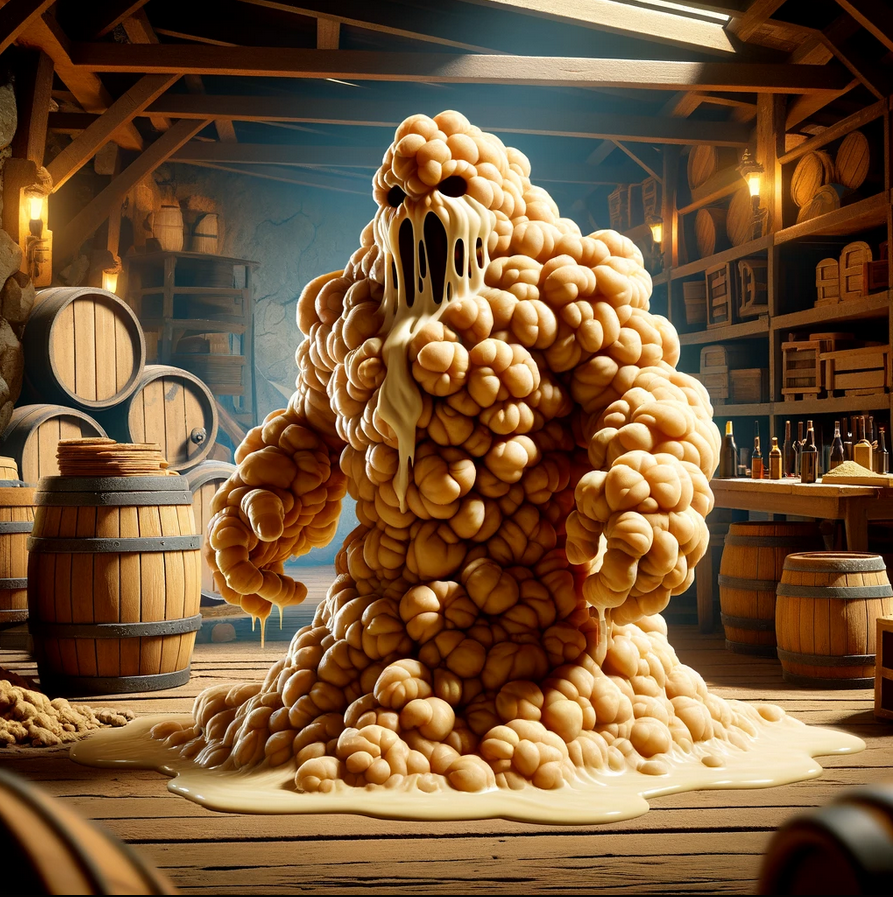
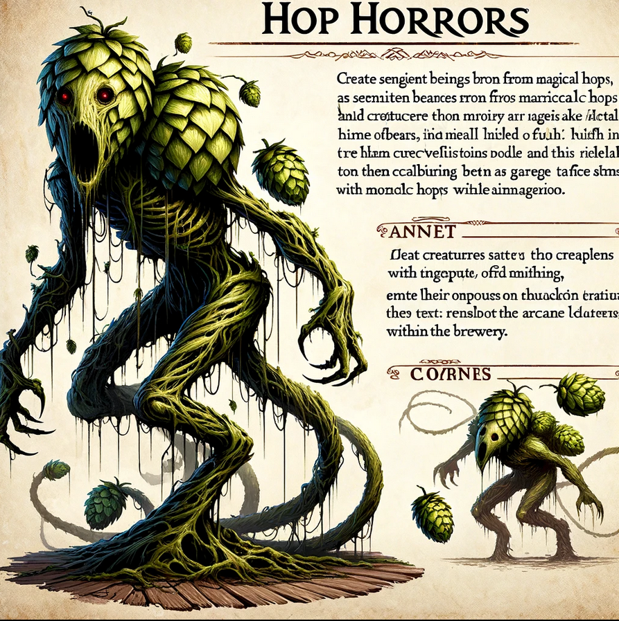

# Alberic's Arcane Ales -  Level 2

Bottling Room

Upon descending the staircase from Alberic's study, the party enters the Bottling Room. This room is where the magical brews of Alberic's Arcane Ales are prepared for distribution, featuring medieval technology enhanced with magic.

## Inhabitants of the Bottling Room

Bottle Golems

Small constructs made from leftover bottles and brewery waste, animated by the residual magic of the room.

- **AC:** 13
- **HP:** 10 (2d6+3)
- **Speed:** 30 ft.
- **Attacks:** Projectile (Bottle Throw) +3 to hit, range 20/60 ft., one target. **Hit:** 4 (1d4+2) piercing damage.
- **Special Abilities:** Shatter on Impact - Upon hitting a target or missing with a throw, the Bottle Golem shatters, potentially causing 1 (1d2) piercing damage to nearby creatures.

Ale Elementals

Sentient beings formed from spilled magical brews, with bodies made entirely of sloshing ale.

- **AC:** 8
- **HP:** 18 (4d8)
- **Speed:** 20 ft., swim 30 ft.
- **Attacks:** `Ale Soak` +3 to hit, reach 5 ft., one target. **Hit:** 5 (1d6+2) bludgeoning damage, and the target is soaked in ale, causing disadvantage on its next attack roll due to slippery hands.
`Bottle throw`: +3 to hit, 1d4 +3 damage
- **Special Abilities:** Summon Barrel - Can enter and animate a barrel of ale, turning a barrel into a barrel brawler.

Fermentation Room

Upon descending from Alberic's study, the party enters the vast Fermenting Room. This area is essential for the transformation of wort into magical brews, with large fermentation tanks powered by both magic and medieval technology.

## Inhabitants of the Fermenting Room

Yeast Beast

A unique creature found within the storeroom, the Yeast Beast acts as a guardian of the brewing ingredients. It appears as a sentient, animated mass of yeast and brewing ingredients, with a constantly shifting form. While whimsical in appearance, it can pose a challenge to those who threaten the storeroom's contents.

- **AC:** 8
- **HP:** 22 (5d8)
- **Speed:** 15 ft.
- **Attack:** Engulf. **Hit:** Engulfs a target within 5 ft., dealing 5 (2d4) bludgeoning damage and potentially trapping smaller creatures inside its mass.
- **Special:** Upon defeat, the Yeast Beast releases a cloud of intoxicating yeast, requiring a DC 10 Constitution saving throw to avoid becoming poisoned for 1 hour.

Hop Horrors

Mutated from magical hops, these vine-like creatures attack with entangling appendages and emit a pungent aroma.

- **AC:** 13
- **HP:** 22 (4d8+4)
- **Speed:** 30 ft., climb 20 ft.
- **Attacks:** 
  - **Vine Lash:** +4 to hit, reach 10 ft., one target. **Hit:** 6 (1d6+3) slashing damage, and the target must succeed on a DC 12 Strength saving throw or be restrained.
- **Special Abilities:** 
  - **Hop Scent:** The pungent smell may cause nausea, requiring a DC 12 Constitution saving throw to resist being poisoned for 1 minute.

Elemental Brewing Chamber

The Elemental Brewing Chamber is the heart of the brewery's magical operations. Huge vats of brewing liquid float in the air, encircled by glowing elemental runes. At the center, an obsessed Alberic, merged with elemental spirits, channels his arcane energy into the brewing process using the `Lunarbloom Mystic Hops`

## Alberic - Elemental Wizard

**Stats:**
- **AC:** 12 (15 with *Mage Armor* activated)
- **HP:** 38 (7d8+7)
- **Speed:** 30 ft.
- **Spellcasting Ability:** Intelligence (spell save DC 13, +5 to hit with spell attacks)
- **Spell Slots:** 3rd level (2 slots), 2nd level (2 slots), 1st level (3 slots)

**Spells Known:**
- **Cantrips (at will):** *Light*, *Mending*, *Message*, *Prestidigitation*
- **1st level:** *Mage Armor* (automatically activated), *Shield*, *Summon Elemental Minion* (custom spell, summons a small elemental to assist in combat)
- **2nd level:** *Misty Step*, *Summon Elemental Minion* (enhanced version, can summon two minions or one of a stronger variety)
- **3rd level:** *Counterspell*, *Summon Elemental Ally* (a more powerful summoning spell that brings forth a medium-sized elemental or several smaller ones to fight)

**Abilities:**
- **Elemental Adept:** Alberic has mastered the art of elemental magic, granting him resistance to fire, cold, and lightning damage.
- **Brewmaster's Command:** Alberic can imbue his elemental summons with properties of his brews, granting them unique abilities (e.g., a hop-infused fire elemental might leave a trail of intoxicating vapor).

